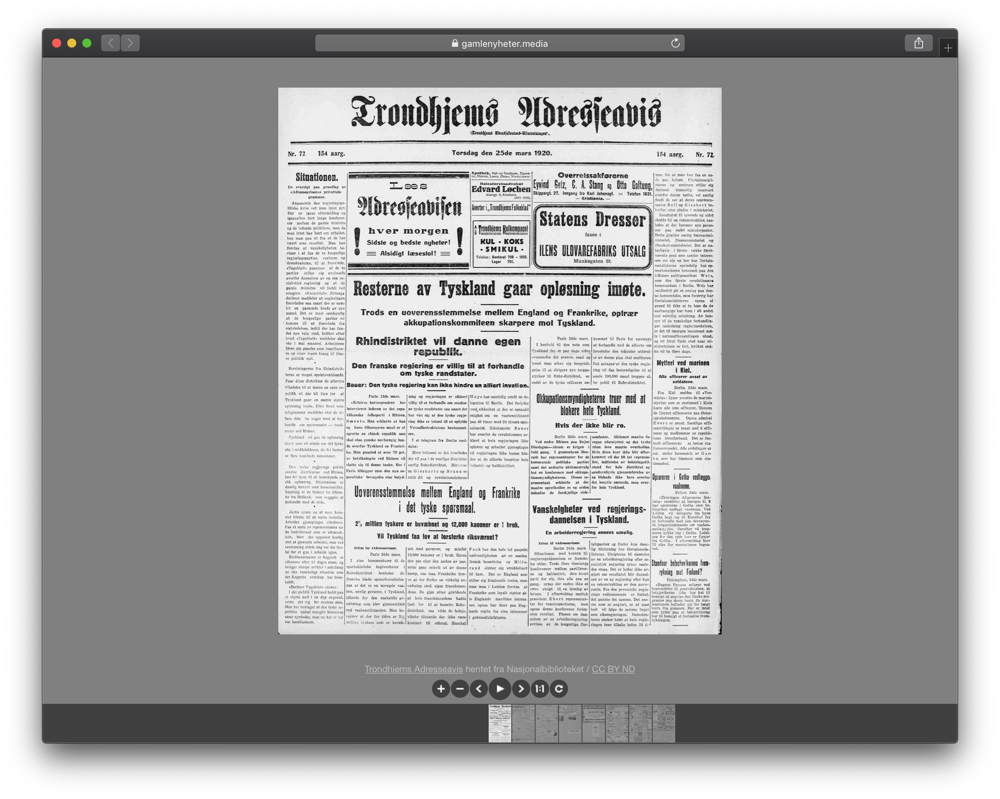

# EIT3014 Eksperter i team - Fortalt digitalt

Webpage for https://gamlenyheter.media, a project developed for EIT3014 "Eksperter i team - Fortalt digitalt" at NTNU. The website shows "todays" Adresseavisen newspaper from 1920, pulled from the [Nasjonalbiblioteket](https://www.nb.no/search?mediatype=aviser&series=%22Adresseavisen%22&fromDate=19200101&toDate=19201231) database. 



## Setup

Run

```
git clone --recursive https://github.com/rosvik/ntnu-eit3014-web
```

To get todays newspaper, run 

```
> python div/dl.py
```

This will add several images to `html/img/output-*.jpg`. You need to have [ImageMagick](https://imagemagick.org/index.php) installed. 
